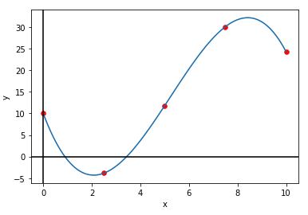
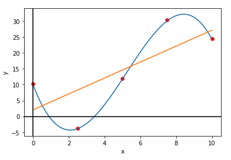
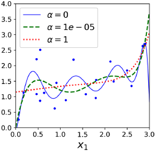
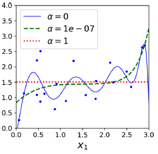
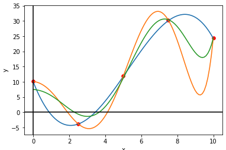
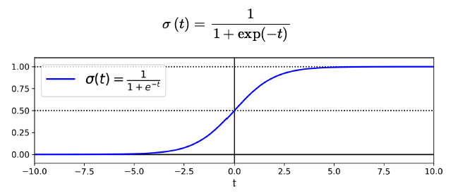
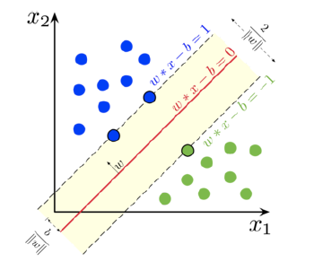
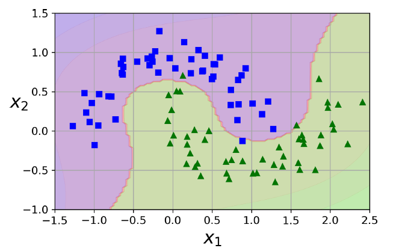
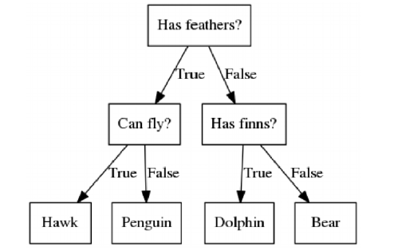

## 1. Matplotlib

NumPy 라이브러리를 활용하여 그래프를 만들어 시각화할 수 있는 라이브러리이다.

지난번 NumPy에 대한 기본적인 설명은 여기에! 👇🏼

[https://sunkyoung.github.io/pytorch-study-01/](https://sunkyoung.github.io/pytorch-study-01/)

- How to use ?

```python
import matplotlib.pyplot as plt
import numpy as np
```

- Basic usage
    - plt.plot(x-axis, y-axis) : 주어진 x축, y축 데이터를 바탕으로 선형 그래프를 그림
    - plt.scatter(x-axis, y-axis, s=None, c=None) : 주어진 x축, y축 데이터를 바탕으로 점을 그림
        - s : 점의 크기
        - c : 색깔 지정 (리스트 형태로도 지정가능하며 리스트 길이만큼 cmap과 norm을 mapping하여 색을 표현)
        - e.g. `plt.scatter(X, y, s=30, c="red")`
    - plt.show() : 플롯을 보여줌
    - np.linspace(start, end, number_of_sample) : sampling을 위해 주로 사용되는 함수이며, start~end 구간 내에 있는 데이터들을 지정한 개수(number_of_sample) 만큼 균등하게 샘플링하여 array형태로 반환해줌
        - end_point=False 로 설정한다면, 리스트의 인덱싱과 같이 start ~ (end-1) 구간으로 설정되며, 기본 값은 end_point=True
        - e.g.
            
            ```python
            np.linspace(2.0, 3.0, num=5)
            # -> array([2.  , 2.25, 2.5 , 2.75, 3.  ])
            np.linspace(2.0, 3.0, num=5, endpoint=False)
            # -> array([2. ,  2.2,  2.4,  2.6,  2.8])
            ```
            
    

위의 기본 사용법을 바탕으로 그래프를 그려보자!

```python
foo = lambda x: -(2/7*x**3-9/2*x**2+15*x-10.)

X = np.linspace(0, 10, 100)
y = foo(X)

x_sample = np.linspace(0, 10, 5)
y_sample = foo(x_sample)

plt.plot(X, y)
plt.scatter(x_sample, y_sample, c="red", s=30)
plt.xlabel('x')
plt.ylabel('y')
plt.axhline(0, color='black')
plt.axvline(0, color='black')
plt.show()
```

→ 출력되는 그래프



## 2. Linear Regression

선형 회귀란, 한 개 이상의 독립 변수 X와 종속 변수 y 간의 선형 상관 관계를 모델링하는 회귀 분석 기법이다. (출처 : [위키피디아](https://ko.wikipedia.org/wiki/%EC%84%A0%ED%98%95_%ED%9A%8C%EA%B7%80))

[Scikit-learn](https://scikit-learn.org/stable/index.html) 라이브러리로 쉽게 많은 [선형 회귀](https://scikit-learn.org/stable/modules/generated/sklearn.linear_model.LinearRegression.html)와 같은 통계적인 모델 + 기계학습 모델들을 정의하고 사용할 수 있다.

- Usage
    
    ```python
    from sklearn.linear_model import LinearRegression
    
    # 선형 회귀 모델 정의
    lr = LinearRegression()
    
    foo = lambda x: -(2/7*x**3-9/2*x**2+15*x-10.)
    x_sample = np.linspace(0, 10, 5)
    y_sample = foo(x_sample)
    
    # 하나의 배치 당 하나의 feature를 가지도록 차원 추가
    x_new = x_sample[:, None]
    
    # 선형 회귀 모델에 fitting하여 학습
    lr.fit(x_new, y_sample)
    
    # Coefficient 계산
    r2 = lr.score(x_new, y_sample)
    
    # y값 예측
    y_hat = lr.predict(x_new)
    # 만약 하나의 데이터 포인트에 대한 예측값을 얻고 싶다면
    # y_hat = lr.predict(x_new[0, None])
    
    # Mean Squared Error 계산
    MSE = np.mean((y_hat - y_sample)**2)
    
    plt.plot(x_new, y_hat)
    ```
    
    → 위의 plot에 더해서 그린 경우에 대한 그래프
    
    
    

## 3. Polynomial Regression

다항 회귀란, 2차 이상의 다항식으로 이루어진 독립 변수 X와 종속 변수 y 간의 상관 관계를 모델링하는 회귀 분석 기법이다. (출처 : [위키피디아](https://en.wikipedia.org/wiki/Polynomial_regression))

위의 선형 회귀 설명에서와 동일하게 [Scikit-learn](https://scikit-learn.org/stable/modules/generated/sklearn.preprocessing.PolynomialFeatures.html)으로 구현되어 있어 쉽게 사용 가능하다.

- Usage

```python
from sklearn.linear_model import LinearRegression
from sklearn.preprocessing import PolynomialFeatures

x_sample = np.linspace(0, 10, 5)
x_new = x_sample[:, None]

foo = lambda x: -(2/7*x**3-9/2*x**2+15*x-10.)
y_sample = foo(x_sample)

# 6차 다항식으로 변환
poly = PolynomialFeatures(degree=6)
x_sample_poly = poly.fit_transform(x_new)
poly_lr = LinearRegression().fit(x_sample_poly, y_sample)

# -> x_new 출력
# Before transform: (Single features)
# [[ 0. ]
#  [ 2.5]
#  [ 5. ]
#  [ 7.5]
#  [10. ]]

# -> x_sample_poly 출력
# After transform: (Multiple features)
# [[1.00000000e+00 0.00000000e+00 0.00000000e+00 0.00000000e+00
#   0.00000000e+00 0.00000000e+00 0.00000000e+00]
#  [1.00000000e+00 2.50000000e+00 6.25000000e+00 1.56250000e+01
#   3.90625000e+01 9.76562500e+01 2.44140625e+02]
#  [1.00000000e+00 5.00000000e+00 2.50000000e+01 1.25000000e+02
#   6.25000000e+02 3.12500000e+03 1.56250000e+04]
#  [1.00000000e+00 7.50000000e+00 5.62500000e+01 4.21875000e+02
#   3.16406250e+03 2.37304688e+04 1.77978516e+05]
#  [1.00000000e+00 1.00000000e+01 1.00000000e+02 1.00000000e+03
#   1.00000000e+04 1.00000000e+05 1.00000000e+06]]
```

아래의 그림과 같이, 항의 차수가 커질 수록 sample들의 특징을 더 잘 반영하여 모델링이 가능하지만 너무 커지면 Overfitting 되는 문제가 있다. 반대로, 항의 차수가 너무 낮으면 Underfitting 되는 문제가 있다.


Overfitting이란, training error는 적고 variance(예측값들의 흩어진 정도)가 큰 반면, test error가 큰 현상이 나타는 문제를 말한다. 즉, training data에 대해서는 좋은 성능을 보일 수는 있어도 학습하지 않은 test data에 대해서는 좋은 성능을 보이지 못한다는 문제점을 가지고 있다. 

→ Overfitting 문제에 대한 대표적인 해결책으로는 더 많은 데이터를 사용하거나 Regularization(정규화)를 하는 방법이 있다.

Underfitting은 Overfitting과는 반대로 training error와 test error가 둘 다 크며, bias(예측값과 정답값과의 차이) 또한 큰 현상이 나타는 문제를 말한다. 이는 충분히 학습되지 않아 나타는 현상이다. 

→ Underfitting 문제에 대한 해결하기 위한 대표적인 방법으로는 더 많은 feature를 추가하거나 항의 차수를 증가하여 모델의 complexity를 높이거나 더 오래 학습하는 방법이 해결책이 될 수 있다.

### Regularization (정규화)

Overfitting 문제를 완화하기 위한 방법 중 Regularization(정규화) 방법은 모델의 자유도를 제한하여 hypothesis space를 줄인다. 즉, 모델의 가중치들을 제한시켜 variance를 줄이고, 일반화하는 능력을 높인다. 대표적인 정규화 방식에는 1) Ridge Regression 2) Lasso Regression 3) Elastic Net 세 가지가 있다. 

각 방식에 대해 하나씩 알아보자 !

#### **Ridge Regression**

Ridge Regression (릿지 회귀) 방법은 L2 Regression으로 불리며, 학습 시 Cost function (비용 함수)에 Loss의 가중치 값들에 대한 L2 regularization term을 더하여 모델의 자유도를 제한한다.

예를 들어, 6차원의 다항식에 대해 다항회귀를 할 때 

<!-- $$w^Tx+b = w_6x^6+w_5x^5+...+w_1x^1+ b$$ --> 

<div align="center"></div>

릿지 회귀 방법에서의 비용 함수는 아래와 같이 표현된다. 

<!-- $$
L(y,y')+\frac{\alpha}{2}\lVert w\rVert^2
$$ --> 

<div align="center"></div>

여기에서 <!-- $$\alpha$$ --> 

<div align="center"></div> 는 제한의 정도(penalty) 지정하는 hyperparameter이다. <!-- $$\alpha$$ --> 

<div align="center"></div> 가 0이면 linear regression 이고, <!-- $$\alpha$$ --> 

<div align="center"></div> 값이 커질 경우 모든 가중치들이 0과 가깝게 되어 예측 값이 데이터들의 평균에 가깝게 flat 한 형태가 된다.



Scikit-learn 구현은
 아래와 같다.

```python
from sklearn.linear_model import Ridge
ridge_reg = Ridge(alpha=0.1)
ridge_reg.fit(X, y)
ridge_reg.predict([[1.5]])
```

#### **Lasso Regression**

Lasso (**L**east **A**bsolute **S**hrinkage and **S**election **O**perator) Regression 는 위의 Ridge regression 에서 사용한 L2 regularization 대신, L1 regularization을 하는 방법이다.

위에 설명한 6차원의 다항식을 토대로, 라쏘 회귀에서의 비용 함수는 다음과 같다.

<!-- $$
L(y,y')+\alpha(|w_6|+|w_5|+...+|w_1|)
$$ --> 

<div align="center"></div>

라쏘 회귀의 큰 특징 중 하나는 중요하지 않은 feature들의 가중치를 제거하는 경향이 있다는 것이다. 

- Why? 역전파(Backpropagation) 시에 비용 함수에 대해 편미분하게 되면, 가중치는 상수 값이 되어버리기 때문에, 가중치가 너무 작은 경우 0에 가까워 중요하지 않은 feature들의 가중치들의 제거하는 효과를 나타내게 된다.

위의 릿지 회귀의 그래프 이미지와 유사하면서도, 가중치를 더 작게 설정하더라도 더 flat하게 만드는 경향이 나타난다. 즉, 자동적으로 feature selection하는 효과를 나타내고 sparse model을 도출해낸다.



Scikit-learn으로 쉽게 사용 가능하다.

```python
from sklearn.linear_model import Lasso
lasso_reg = Lasso(alpha=0.1)
lasso_reg.fit(X, y)
lasso_reg.predict([[1.5]])
```

#### **Elastic Net** 

Elastic Net은 Ridge Regression 과 Lasso Regression의 중간으로, 두 regularization term을 섞어 사용한다. mix ratio r 으로 조절할 수 있다.

<!-- $$
L(y,y')+r\alpha(\sum_{i=1}^n|w_i|)+\frac{l-r}{2}\alpha\lVert w\rVert^2
$$ --> 

<div align="center"></div>

세 가지 정규화 방법 중에 보통 Ridge를 기본으로 많이 사용되지만, 일부 적은 feature만 유용할 때 Lasso 나 Elastic Net을 사용한다. 보통 Lasso의 경우 feature의 개수가 training instance보다 많거나 일부 feature들이 correlate될 때 예측이 어려우므로, Lasso 보다 Elastic Net이 선호된다.

Scikit-learn으로 쉽게 사용 가능하다.

```python
from sklearn.linear_model import ElasticNet
elastic_net = ElasticNet(alpha=0.1, l1_ratio=0.5)
elastic_net.fit(X, y)
elastic_net.predict([[1.5]])
```

### 다항 회귀 vs 릿지 회귀

다항 회귀에 대해 릿지 정규화의 적용한 릿지 회귀 또한 [scikit-learn](https://scikit-learn.org/stable/modules/generated/sklearn.linear_model.Ridge.html) 라이브러리로 쉽게 적용 가능하다.

- Implementation
    
    ```python
    from sklearn.linear_model import LinearRegression
    from sklearn.preprocessing import PolynomialFeatures
    from sklearn.linear_model import Ridge
    
    x_line = np.linspace(0, 10, 100)
    x_sample = np.linspace(0, 10, 5)
    x_new = x_sample[:, None]
    
    foo = lambda x: -(2/7*x**3-9/2*x**2+15*x-10.)
    Y = foo(x_line)
    y_sample = foo(x_sample)
    # 6차 다항식으로 변환
    poly = PolynomialFeatures(degree=6)
    x_sample_poly = poly.fit_transform(x_new)
    x_line_poly = poly.fit_transform(x_line[:, None])
    
    # 다항 회귀 적용 및 예측
    poly_lr = LinearRegression().fit(x_sample_poly, y_sample)
    y_poly = poly_lr.predict(x_line_poly)
    
    # Ridge 회귀 적용 및 예측
    # penalty의 정도를 나타내는 lambda는 'alpha'라는 hyperparameter로 사용됨 !
    rr = Ridge(alpha=10.0).fit(x_sample_poly, y_sample)
    y_poly_rr = rr.predict(x_line_poly)
    ```
    
    → Plot으로 표현
    
    (blue: 정답 값, orange: 다항 회귀 예측 값, green: 릿지 회귀 값)
    
    
    

## 4. Classification (Logistic Regression, Support Vector Machine, Decision Tree)

대표적인 Classification(분류) 모델으로는 다음과 같이 세 가지가 있다.

- Logistic Regression (로지스틱 회귀)
- Support Vector Machine (SVM) (서포트 벡터 머신)
- Decision Tree (결정 트리)

### Logistic Regression (로지스틱 회귀)

로지스틱 회귀는 선형 회귀와 같이 입력 feature들의 weighted sum을 계산하지만, 결과를 바로 출력하는 것이 아니라 결과의 logistic을 출력한다. logistic 은 sigmoid function을 뜻하며 0과 1 사이의 값을 가진다. 



- logit (log-odds) : logistic function의 역으로, positive class인지 negative class인지 측정된 확률(p)의 ratio의 log 값이다.
    
    <!-- $$logit(p) = log(p/(1-p))$$ --> 

<div align="center"></div>
    

closed-form equation이 아니기 때문에, 비용함수를 최소화 하는 parameter를 계산하는 것이 어렵지만, 비용함수가 convex 형태일 경우 Gradient Descent와 같은 최적화 알고리즘을 사용한다면 global optimum을 찾을 수 있다.

- multiple classes의 경우, softmax regression(multinomial logistic regression)으로 사용할 수 있다. 이 때, 클래스와 클래스 별 확률을 match하여 측정하는 cross entropy 비용 함수를 사용한다.

### Support Vector Machine (SVM) (서포트 벡터 머신)

서포트 벡터 머신 분류는 쉽게 설명하자면, 분류하고자 하는 두 클래스 간의 거리(margin)를 최대화하는 모델이다. small or medium 크기의 데이터 셋에 적합한 모델이다



두 카테고리 중 어느 하나에 속한 데이터의 집합이 주어졌을때, 주어진 데이터 집합을 바탕으로 새로운 데이터가 어느 카테고리에 속할지 판단하는 비확률적 이진 선형 분류 모델을 만든다. 이 때, 데이터가 임베딩된 공간에서 경계(boundary)를 표현할 때 가장 큰 폭(large margin)을 가진 경계를 찾는다. 즉, 가장 가까운 각 클래스의 데이터 점들 간의 거리를 최대로 한다.

때문에, 학습이 진행되는 동안 SVM은 각 훈련 데이터 포인트가 두 클래스 사이의 결정 경계를 구분하는 데 얼마나 중요한 지를 배우게 된다. 데이터셋 전체가 아닌 클래스 사이의 경계에 위치한 데이터 포인트들이 결정 경계를 만드는 데 영향을 준다. 이러한 데이터 포인트들을 서포트 벡터(support vector)라고 한다.

선형 분류 뿐만 아니라 비선형 분류에서도 사용될 수 있으며, 선형적으로 분류가 어려운 데이터에 Feature를 더해(polynomial feature) 고차원 공간으로 대응시켜 분리를 쉽게 하는 방법을 사용한다. polynomial degree가 클 수록 모델이 느려지기 때문에, 문제에 적절한 kernel trick을 사용한다. 이는 점들의 집합과 상수 벡터의 내적 연산으로 정의하여 효율적으로 계산하도록 돕는다. 큰 데이터셋의 경우, Gaussian RBF Kernel을 사용한다.



장점 : 분류, 예측에 사용 가능. overfitting 정도가 덜하다. 예측의 정확도가 높고, 사용하기 쉬움

단점 : kernel, parameter 조절 테스트를 여러번 해야 최적화된 모델을 만들 수 있음, 모델 구축 시간 오래걸림

### Decision Tree (결정 트리)

결정 트리 알고리즘은 Feature에 대해 아래의 그림과 같이 트리 자료 구조 기반으로 분류한다. 



결정 트리는 feature scaling이나 centering과 같은 데이터 전처리가 필요하지 않다.

Scikit-Learn 라이브러리에서의 구현은 Classification and Regression Tree(CART) 알고리즘을 기반으로 학습한다.

먼저, 학습 데이터에 대해 하나의 feature <!-- $$k$$ --> 

<div align="center"></div> 와 그에 대한 threshold <!-- $$t_k$$ --> 

<div align="center"></div> 를 기준으로 두 개의 subset으로 나눈다. 이 때, threshold는 잘 분리된(Purest) Subset이 되도록 <!-- $$(k, t_k)$$ --> 

<div align="center"></div> 쌍을 찾아서 설정한다.

<!-- $$
J(k,t_k)=\frac{m_{left}}{m}G_{left}+\frac{m_{right}}{m}G_{right}
$$ --> 

<div align="center"></div>

<!-- $$G_{left/right}$$ --> 

<div align="center"></div> 는 left, right subset의 잘 분리되지 않음의 정도(impurity)를 뜻하고, <!-- $$m_{left/right}$$ --> 

<div align="center"></div> 은 left, right 각 subset의 개수를 뜻한다. 

Regression 문제에 적용한다면, <!-- $$G_{left/right}$$ --> 

<div align="center"></div> 대신 <!-- $$MSE_{left/right}$$ --> 

<div align="center"></div> loss를 사용한다.

<!-- $$
MSE_{node} = \sum_{i \in node}(\hat y_{node} - y^{(i)})^2 \\ \hat y_{node}= \frac{1}{m_{node}}\sum_{i \in node}y^{(i)}
$$ --> 

<div align="center"></div>

**max_depth** parameter로 두어, 위의 과정을 재귀적으로 반복하며 depth만큼의 트리를 구축한다.

선형 모델과 달리 결정 트리 모델의 경우 학습 데이터에 대하 제한하는 정도가 적기 때문에, 학습 데이터에 트리 구조가 너무 adapt하게 학습 될 경우에 overfitting 문제가 발생할 수 있다. 파라미터가 없다기 보다 파라미터로 인한 제한이 학습 이전에 없는 모델을 nonparametric 모델이라고 부른다. 반대로 parametric 모델은 degree of freedom이 제한되기 때문에 overfitting의 위험을 줄일 수 있다. overfitting을 줄이기 위해서 freedom을 제한하기 위해 정규화(regularization)을 적용한다. 자세한 hyperparameter는 [여기](https://scikit-learn.org/stable/modules/tree.html#tips-on-practical-use)에 설명되어 있다.

### Implementation

위의 세 모델 ([Logistic Regression](https://scikit-learn.org/stable/modules/generated/sklearn.linear_model.LogisticRegression.html), [Support Vector Machine](https://scikit-learn.org/stable/modules/svm.html#), [Decision Tree](https://scikit-learn.org/stable/modules/tree.html#)) 모두 Scikit-learn 라이브러리로 간단하게 구현하여 사용할 수 있다.

```python
from sklearn.linear_model import LogisticRegression

logistic = LogisticRegression(random_state=1234)
logistic.fit(X_train[:, :2], y_train)
# softmax regression
# softmax_reg = LogisticRegression(multi_class="multinomial")

from sklearn.svm import SVC

svm = SVC(kernel='linear', random_state=1234)
svm.fit(X_train[:, :2], y_train)

from sklearn.tree import DecisionTreeClassifier
# more depth, increase decision boundary - leads to overfitting 
# similar to polynomial
dt = DecisionTreeClassifier(max_depth=2, random_state=1234) 
dt.fit(X_train[:, :2], y_train)
```

👉🏼 관련 실습 코드 :

[https://github.com/Sunkyoung/PyTorch-Study/blob/main/PyTorch_Study_02_Basic_ML.ipynb](https://github.com/Sunkyoung/PyTorch-Study/blob/main/PyTorch_Study_02_Basic_ML.ipynb)

**Reference**

Aurelien Geron, Hands-on Machine Learning with Scikit-Learn, Keras, and TensorFlow, O’reilly (2019)

```toc

```