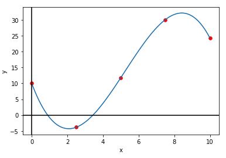
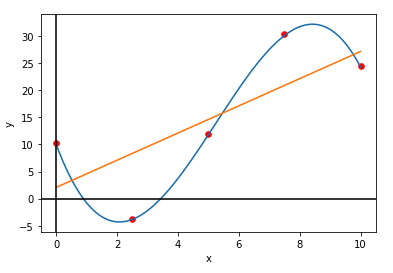

## 1. Matplotlib

NumPy 라이브러리를 활용하여 그래프를 만들어 시각화할 수 있는 라이브러리이다.

지난번 NumPy에 대한 기본적인 설명은 여기에! 👇🏼

[https://sunkyoung.github.io/pytorch-study-01/](https://sunkyoung.github.io/pytorch-study-01/)

- How to use ?

```python
import matplotlib.pyplot as plt
import numpy as np
```

- Basic usage
    - plt.plot(x-axis, y-axis) : 주어진 x축, y축 데이터를 바탕으로 선형 그래프를 그림
    - plt.scatter(x-axis, y-axis, s=None, c=None) : 주어진 x축, y축 데이터를 바탕으로 점을 그림
        - s : 점의 크기
        - c : 색깔 지정 (리스트 형태로도 지정가능하며 리스트 길이만큼 cmap과 norm을 mapping하여 색을 표현)
        - e.g. `plt.scatter(X, y, s=30, c="red")`
    - plt.show() : 플롯을 보여줌
    - np.linspace(start, end, number_of_sample) : sampling을 위해 주로 사용되는 함수이며, start~end 구간 내에 있는 데이터들을 지정한 개수(number_of_sample) 만큼 균등하게 샘플링하여 array형태로 반환해줌
        - end_point=False 로 설정한다면, 리스트의 인덱싱과 같이 start ~ (end-1) 구간으로 설정되며, 기본 값은 end_point=True
        - e.g.
          
            ```python
            np.linspace(2.0, 3.0, num=5)
            # -> array([2.  , 2.25, 2.5 , 2.75, 3.  ])
            np.linspace(2.0, 3.0, num=5, endpoint=False)
            # -> array([2. ,  2.2,  2.4,  2.6,  2.8])
            ```
            
    

위의 기본 사용법을 바탕으로 그래프를 그려보자!

```python
foo = lambda x: -(2/7*x**3-9/2*x**2+15*x-10.)

X = np.linspace(0, 10, 100)
y = foo(X)

x_sample = np.linspace(0, 10, 5)
y_sample = foo(x_sample)

plt.plot(X, y)
plt.scatter(x_sample, y_sample, c="red", s=30)
plt.xlabel('x')
plt.ylabel('y')
plt.axhline(0, color='black')
plt.axvline(0, color='black')
plt.show()
```

→ 출력되는 그래프



## 2. Linear Regression

선형 회귀란, 한 개 이상의 독립 변수 X와 종속 변수 y 간의 선형 상관 관계를 모델링하는 회귀 분석 기법이다. (출처 : [위키피디아](https://ko.wikipedia.org/wiki/%EC%84%A0%ED%98%95_%ED%9A%8C%EA%B7%80))

[Scikit-learn](https://scikit-learn.org/stable/index.html) 라이브러리로 쉽게 많은 [선형 회귀](https://scikit-learn.org/stable/modules/generated/sklearn.linear_model.LinearRegression.html)와 같은 통계적인 모델 + 기계학습 모델들을 정의하고 사용할 수 있다.

- Usage
  
    ```python
    from sklearn.linear_model import LinearRegression
    # 선형 회귀 모델 정의
    lr = LinearRegression()
    
    foo = lambda x: -(2/7*x**3-9/2*x**2+15*x-10.)
    x_sample = np.linspace(0, 10, 5)
    y_sample = foo(x_sample)
    
    # 하나의 배치 당 하나의 feature를 가지도록 차원 추가
    x_new = x_sample[:, None]
    
    # 선형 회귀 모델에 fitting하여 학습
    lr.fit(x_new, y_sample)
    
    # Coefficient 계산
    r2 = lr.score(x_new, y_sample)
    
    # y값 예측
    y_hat = lr.predict(x_new)
    # 만약 하나의 데이터 포인트에 대한 예측값을 얻고 싶다면
    # y_hat = lr.predict(x_new[0, None])
    
    # Mean Squared Error 계산
    MSE = np.mean((y_hat - y_sample)**2)
    
    plt.plot(x_new, y_hat)
    ```
    
    → 위의 plot에 더해서 그린 경우에 대한 그래프
    
    
    

## 3. Polynomial Regression

다항 회귀란, 2차 이상의 다항식으로 이루어진 독립 변수 X와 종속 변수 y 간의  상관 관계를 모델링하는 회귀 분석 기법이다. (출처 : [위키피디아](https://en.wikipedia.org/wiki/Polynomial_regression))


## 4. Classification (Logistic Regression, Support Vector Machine, Decision Tree)


👉🏼 관련 실습 코드 :

[https://github.com/Sunkyoung/PyTorch-Study/blob/main/PyTorch_Study_02_Basic_ML.ipynb](https://github.com/Sunkyoung/PyTorch-Study/blob/main/PyTorch_Study_02_Basic_ML.ipynb)


```toc

```